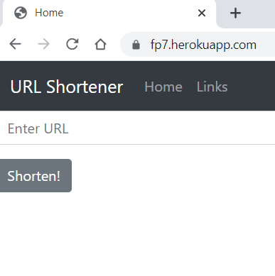
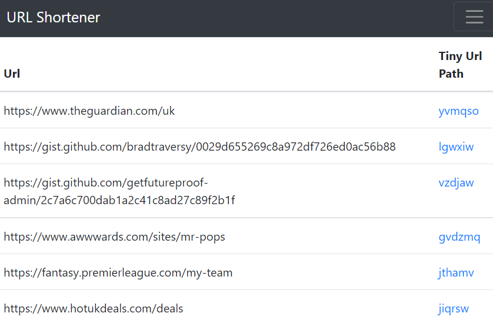

# URL Shortener - Code Challenge - by Cami & Karl

## Project Overview

For this project we wanted to produce a URL Shortener. The technology we chose to solve this was Python and flask for the app and Postgres for the database. It was deployed on [Heroku](https://fp7.herokuapp.com/).




## Installation and usage

Users can enter a URL that they would like to shorten. They then just need to click the 'Shorten!" button and it will take you to a new page and display the full URL and the tiny URL.

There is an extra page called Links that display all of the URL's currently stored in the database.

The database is persistent as it was deployed seperately to heroku using a postgres addon.

### To run the app you have a few options:

1. Go to the deployed [site](https://fp7.herokuapp.com/).(*Easiest Option*)
2. Run it locally -
```pipenv shell && pipenv install && flask run```
